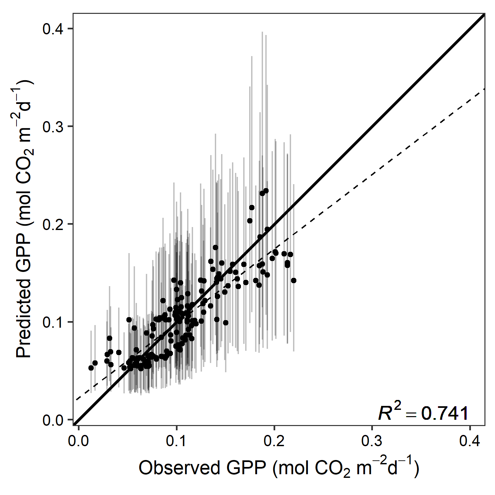

<style>
p.caption {
  font-size: 1.25em;
}
</style>

```{r setup, include=FALSE}
knitr::opts_chunk$set(echo = TRUE)
```

## Figures


```{r fig-env, echo=FALSE, out.width="100%", fig.cap="<b>Fig. 1</b> Daily site-level environmental characteristics of <b>a)</b> maximum vapor pressure deficit (D) and total precipitation and <b>b)</b> mean volumetric water content (VWC) at 5 cm and 10 cm. Labeled boxes subdivide the study period into before, during, and after the monsoon season"}
knitr::include_graphics("../../scripts/model-pd-md/figs/fig_1_sep.png")
```

```{r fig-psy, echo=FALSE, out.width="100%", fig.cap="<b>Fig. 2</b> Time series of <b>a)</b> chamber and automated daily measurements of stem water potential and <b>b)</b> daily total gross primary productivity (GPP). Labeled boxes subdivide the study period into before, during, and after the monsoon season"}
knitr::include_graphics("../../scripts/model-pd-md/figs/fig_2.png")
```

```{r fig-gpp, echo=FALSE, out.width="100%", fig.cap="<b>Fig. 3</b> Midday vs. predawn stem water potential divided by the three seasons. Points are colored by the concurrent daily VWC at 10 cm"}
knitr::include_graphics("../../scripts/model-pd-md/figs/fig_3.png")
```


```{r fig-hydry-params, echo=FALSE, out.width="100%", fig.cap="<b>Fig. 4</b> Posterior mean and 95% CI of the <b>a)</b> regression coefficients and <b>b)</b> antecedent weights $\\omega$ of covariates associated with $\\sigma$ and $\\lambda$"}
knitr::include_graphics("../../scripts/model-pd-md/figs/fig_4.png")
```

```{r fig-gpp-params, echo=FALSE, out.width="100%", fig.cap="<b>Fig. 5</b> Posterior mean and 95% CI of the <b>a)</b> regression coefficients and <b>b)</b> antecedent weights $\\omega$ of covariates associated with GPP"}
knitr::include_graphics("../../scripts/model-flux-daily/figs/fig_5.png")
```

```{r fig-hydry, echo=FALSE, out.width="100%", fig.cap="<b>Fig. 6</b> Relationship between predicted $\\sigma$ (posterior mean and 95% CI) and daily GPP shown as <b>a)</b> time series across three seasons, <b>b)</b> bivariate plots for each season, and <b>c)</b> Pearson's correlation (estimate and 95% confidence interval) during monsoon season across a range of daily offsets where GPP leads $\\sigma$"}
knitr::include_graphics("../../scripts/model-pd-md/figs/fig_6.png")
```


## SI Figures

```{r fig-hydry-fit, echo=FALSE, out.width="90%", fig.cap="<b>Fig. S1</b> Observed vs. predicted $\\Psi_{MD}$ ($R^2 = 0.92$)"}
knitr::include_graphics("../../scripts/model-pd-md/figs/fig_S1.png")
```

```{r fig-gpp-fit, echo=FALSE, out.width="75%", fig.cap="<b>Fig. S2</b> Observed vs. predicted GPP ($R^2 = 0.74$)"}

```
