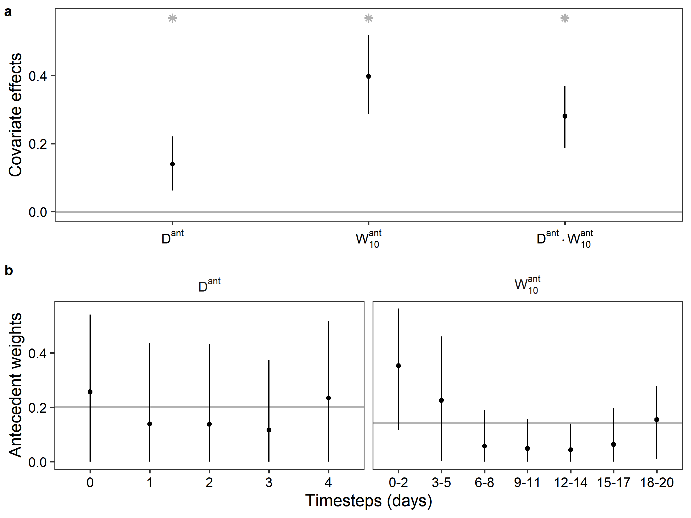

```{r setup, include=FALSE}
knitr::opts_chunk$set(echo = TRUE)
```

\pagebreak

### Summary

-   Some plants exhibit temporally flexible hydraulic regulation, wherein the strictness of hydraulic control (e.g., iso/anisohydry) changes in response to environmental conditions.
    However, the environmental controls over iso/anisohydry and the implications of flexible hydraulic behavior for plant productivity remains unknown.

-   In *Juniperus osteosperma*, a drought-resistant dryland conifer, we amassed a 5-month growing season timeseries of *in situ*, high temporal-resolution plant water potential ($\Psi$) and stand GPP.
    We then quantified the stringency of hydraulic regulation in relation to soil water availability and atmospheric demand, along with its implications for carbon uptake.

-   *J. osteosperma* experiences weaker hydraulic regulation (i.e., anisohydry) and higher productivity after monsoon precipitation pulses, when soil moisture and atmospheric demand are both high.
    The slope between $\Psi_{PD}$ and $\Psi_{MD}$ ($\sigma$), a common meetric for quantifying iso/anisohydry, is strongly correlated with GPP, although only during the monsoon period.

-   Flexible hydraulic regulation appears to allow *J. osteosperma* to prolong soil water extraction and the period of high carbon uptake following episodic rain events during the growing season.
    While the underlying physiological mechanisms that allow for temporal adjustment need further study, this flexibility can partially explain the success of some drought-tolerant species and suggests why dynamic vegetation models often underestimate the productivity of dryland ecosystems.

\pagebreak

### Introduction

Along the soil-plant-atmosphere continuum, gradients of water potential ($\Psi$) drive water transport and integrate the tradeoff between obtaining carbon dioxide for photosynthesis and water loss through stomata [@berry2010]. Plant water use strategies encompass the numerous ways plants have evolved to confront this inescapable dilemma, including the popular iso/anisohydry spectrum based on the stomatal regulation of $\Psi$ [@tardieu1998; @jones1998].
Isohydry describes a conservative strategy of stomatal closure to maintain $\Psi$ above a threshold to preserve hydraulic conductivity, while anisohydry is a profligate stomatal strategy that prioritizes carbon gain at the expense of low $\Psi$.
While degree of iso/anisohydry is usually operationalized as a species-level trait, recent work has demonstrated that these strategies are quite variable within a species, which may arise from plant-environment interactions in accordance with hydraulic theory [@hochberg2018].
Within species shifts in iso/anisohydry have been reported for *Larrea tridentata* [@guo2020] and *Quercus douglasii* [@feng2019] in different seasons, in *Quercus suber* due to competition [@haberstroh], *Acacia aptaneura* as a result of repeated experimental drought [@nolan2017], and in multiple species between wet and dry years [@wu2021].

However, the ecosystem carbon (C) flux implications of temporally-variable hydraulic strategies are not well understood, but are important for forecasting and ameliorating the effects of climate change [@novick2022; @kennedy2019]. Particularly in dryland ecosystems, persistent water limitation and episodic precipitation promote tight coupling between carbon and water cycles [@biederman2016], resulting in added temporal complexity that can be difficult to model [@ogle2004; @noy-meir1973; @loik2004; @feldman2018]. Dryland ecosystems are largely responsible for the interannual variability of the global carbon sink [@poulter2014; @ahlstrom2015], including rapid vegetation expansion associated with wet years, yet dynamic global vegetation models are prone to underestimating C uptake in dryland regions [@macbean2021].
Understanding the temporal dynamics and environmental sensitivity of plant hydraulic strategies may be critical to improving predictive forecasts of the global carbon cycle.

Drought-induced mortality in pinyon-juniper woodlands is an iconic consequence of climate change in the southwestern US.
Pinyon mortality following the 2002-2003 drought was associated with differences in plant hydraulic regulation [@breshears2009; @plaut2012]; juniper survival was largely attributed to less hydraulically vulnerable xylem and thus greater ability to withstand low water potentials [@mcdowell2008].
Although generally considered anisohydric, *Juniperus monosperma* exhibited strong stomatal control and negligible xylem embolism under drought manipulation [@garcia-forner2016], thus challenging the hypothesis of anisohydric species being prone to hydraulic failure.
As the southwestern US megadrought persists [@williams2022] and induces mortality even among resilient *Juniperus* spp.
[@kannenberg2021], it is imperative to probe how anisohydric strategies interact with plant productivity and survival.

In this study, we utilize a five month time-series of plant $\Psi$ and ecosystem C fluxes in a juniper woodland to evaluate the relationship and temporal dynamics between hydraulic strategy and gross primary productivity (GPP).
By contemporaneously measuring plant $\Psi$ and GPP continuously at daily temporal resolution, we can directly investigate the implications of $\Psi$ regulation for productivity in an iconic southwestern species.We ask:

1)  Does plant hydraulic regulation vary over time in *J. osteosperma*?
2)  Do drivers of hydraulic regulation differ from those of GPP?
3)  What is the relationship between hydraulic regulation and GPP over a growing season?

### Materials and Methods

This study was conducted at an early-successional pinyon-juniper woodland (37.5241 N, 109.7471 W, 1866 m a.s.l.) in southeastern Utah.
Local climate conditions include cold winters and hot, dry summers, with high interannual variability in summer precipitation due to its location at the northern boundary of the North American Monsoon.
The locally flat topography is dominated by Utah juniper (*Juniperus osteosperma*, 92% tree basal area) and two-needle pinyon (*Pinus edulis*, 8% tree basal area), with sparse understory comprising big sagebrush (*Artemisia tridentata*), prickly pear cactus (*Opuntia* spp.), and bunchgrasses.
See Kannenberg et al. in review for further site details.

#### Eddy covariance and environmental variables

An eddy covariance flux tower (AmeriFlux US-CdM) was deployed in June 2019 to measure fluxes of water, carbon, and energy and to monitor site-level meteorological and soil variables [@kannenberg2022].
The sonic anemometer (Campbell Scientific CSAT3), open-path infrared gas analyzer (Campbell Scientific EC150), and temperature/relative humidity sensor (Vaisala HMP155) were installed at a height of 8 m, while the net radiometer (Kipp and Zonen CNR4) and photosynthetic photon flux density sensor (Kipp and Zonen PQS1) were installed at a height of 6.45 m.
Site precipitation was measured with a tipping bucket rain gauge (Campbell Scientific TE535WS), while volumetric water content and temperature of the soil were monitored with five sensors (Acclima TDT) deployed at depths of 5 cm, 10 cm, 20 cm, 50 cm, and 100 cm.
See Kannenberg et al. in review for additional details on calibration and maintenance.

Eddy covariance and environmental data were processed first by summarizing to half-hourly values, gapfilling, and then summarizing to daily values used the the subsequent figures and analysis.
High frequency eddy covariance data were processed into half-hourly values of net ecosystem exchange (NEE) using *EasyFlux PC* (Campbell Scientific) following a procedure of despiking [@vickers1997], coordinate rotation, spectral correction [@massman2000], and Webb-Pearman-Leuning density correction [@webb1980].
NEE was gap-filled using the 50th percentile Ustar distribution and partitioned into gross primary productivity (GPP) and ecosystem respiration using the nighttime method [@reichstein2005] in the R package 'REddyProc' [@wutzler2018].
All environmental variables were summarized to half-hourly means or sums where appropriate; air temperature, vapor pressure deficit, and incoming shortwave radiation were gap-filled using the MDS algorithm [@reichstein2005].
Ecosystem fluxes and precipitation were aggregated to daily sums, vapor pressure deficit was summarized to daily maximums, and the remaining environmental variables were summarized as daily means.

#### Plant water potential

Stem water potential of seven mature *J. osteosperma* within the tower footprint (\< 20 m) were monitored with both automated and manual measurements between May 24 and November 5, 2021.
Half-hourly water potential was monitored with stem psychrometers (ICT International PSY1) that were calibrated prior to installation.
Two instruments were installed per tree by removing the bark and phloem to expose a flat xylem surface.
Psychrometer sensor heads were attached with self-adhesive silicone tape to maintain a tight seal and wrapped in reflective insulation to minimize temperature gradients.
Because plant wounding responses can fill the sensor chamber, each psychrometers was uninstalled, cleaned with chloroform, and reinstalled on a new branch every 4-5 weeks.
The day after reinstallation, xylem water potential was measured manually with a Scholander-type pressure chamber (PMS 610) by excising a needle cluster with diameter between 2 and 4 mm and measuring within 2 minutes of collection.

Half-hourly stem water potential time series were subject to quality control by visual assessment and processed to daily values.
After removing data during the maintenance period (+ 1 day) and outliers that were \> 0.5 MPa way from adjacent points, data that met the following criteria were also discarded: 1) a step change in the magnitude of water potential not attributable to a precipitation event; 2) loss of diurnal pattern in water potential.
On average, data from 10 of 14 psychrometers were available during a given period.
Half-hourly stem water potential was summarized to predawn ($\Psi_{PD}$, 2 hours prior to sunrise) and midday ($\Psi_{PD}$, 2 hours following solar noon) for each logger.

#### Model description - hydraulic regulation

To specify the hydraulic regulation model, we used the Martinez-Vilalta et al. [@martínez-vilalta2014] equation to relate $\Psi_{MD}$ to $\Psi_{PD}$:

$$
\begin{array}{c}
\tag{1}
\Psi_{MD} = \sigma \cdot \Psi_{PD} + \lambda
\end{array}
$$

where $\sigma$ represents the stringency of hydraulic regulation and $\lambda$ describes the pressure drop when soil moisture is not limiting.
Plant hydraulic regulation can be described as isohydry if $\sigma<1$, anisohydry if $\sigma\approx1$, and extreme anisohydry if $\sigma > 1$.

To allow hydraulic regulation and GPP to vary over the growing season, we specified a hierarchical Bayesian model that estimated $\sigma$, $\lambda$, GPP as linear functions of maximum daily vapor pressure deficit ($D$) and volumetric soil water content at 10 cm ($W_{10}$), which had the highest correlation with plant $\Psi$ and GPP (Kannenberg et al. in review).
Furthermore, we implemented the stochastic antecedent model [@ogle2015] to quantify the influence of past environmental conditions.
The data model for hydraulic regulation describes the likelihood of each observed $\Psi_{MD}$, which was normally distributed for each observation $i$ ($i = 1, 2, \ldots, 1425$):

$$
\begin{array}{c}
\tag{2}
{\Psi_{MD}}_i \sim Normal({{\overline{\Psi}}_{MD}}_i, \sigma_{\Psi}^2)
\end{array}
$$

where ${{\overline{\Psi}}_{MD}}_i$ is the predicted or mean midday water potential and $\sigma_{\Psi}^2$ represents the observation variance.
${{\overline{\Psi}}_{MD}}_i$ was modeled according to Eqn 1, where all terms were allowed to vary over time, either as direct observations ($\Psi_{MD}$,$\Psi_{PD}$) or as modeled parameters ($\sigma$, $\lambda$).
The time-varying estimates of hydraulic regulation, $\sigma$ and $\lambda$ were indexed by $i$ and modeled as linear combinations of two antecedent covariates and their interaction:

$$
\begin{array}{c}
\tag{3}
\sigma_i = \beta_0 + \beta_1 \cdot D_i^{ant} + \beta_2 \cdot {W_{10}}_i^{ant} + \beta_3 \cdot D_i^{ant} \cdot {W_{10}}_i^{ant} + \mathcal{E}_{\sigma, t(i)}\\
\lambda_i = \alpha_0 + \alpha_1 \cdot D_i^{ant} + \alpha_2 \cdot {W_{10}}_i^{ant} + \alpha_3 \cdot D_i^{ant}\cdot {W_{10}}_i^{ant} + \mathcal{E}_{\lambda, t(i)}
\end{array}
$$

The $\beta$ and $\alpha$ parameters were estimated for all trees.
$\mathcal{E}_{\sigma}$ and $\mathcal{E}_{\lambda}$ represent the random effects of each tree, where $t(i)$ indicates tree $t$ associated with each observation $i$.
$D_{max}$ and $W_{10}$ were scaled using the 2021 mean and standard deviation so that regression coefficients could be compared and $\beta_0$ and $\alpha_0$ could be interpreted as $\sigma$ and $\lambda$, respectively, under mean environmental conditions.
Antecedent variables [@ogle2015] were constructed using daily time series of each scaled environmental variable:

$$
\begin{array}{c}
\tag{4}
D_i^{ant} = \sum_{p = 0}^{T_{lag}}\omega_{D_p} \cdot D_{t(i)-p}\\
{W_{10}}_i^{ant} = \sum_{p = 0}^{T_{lag}}\omega_{W_p} \cdot W_{t(i)-p}
\end{array}
$$

where $p$ indicates the time step, $T_{lag}$ represents the total number of past time-steps considered, $\omega_{D_p}$ and $\omega_{W_p}$ indicates the weight or relative importance of the $p$th time step into the past, and $D_{t(i)-p}$ and $W_{t(i)-p}$ are the observed value of each variable at $p$ time steps ago.
Antecedent covariates are weighted averages of past covariate values where the weights are stochastically determined by the data.
In this analysis, $D^{ant}$ was constructed using daily values from the current day to 4 days ago ($p$ = 1, $T_{lag}$ = 5), while $W_{10}^{ant}$ was constructed using three-day averages of $W_{10}$ from the current day to 20 days ago ($p$ = 3, $T_{lag}$ = 7).

In order to complete this model, a zero-centered hierarchical normal prior was specified for tree random effects:

$$
\begin{array}{c}
\tag{5}
\mathcal{E}_{\sigma, t} \sim Normal(0, \sigma_{\sigma}^2)\\
\mathcal{E}_{\lambda, t} \sim Normal(0, \sigma_{\lambda}^2)
\end{array}
$$

where reparameterization by sweeping was employed to ensure identifiability between the intercepts ($\beta_0$, $\alpha_0$) and the random effects [@vines1996].

All remaining parameters were given standard priors following Gelman et al. [-@gelman2014].
The regression coefficients were assigned relatively non-informative normal priors centered at zero with large variance.
Antecedent importance weights, vectors of length $T_{lag}$ (Eqn 4), were given non-informative Dirichlet priors that assume *a priori* that each past time step has equal importance, and that constrain weights for each covariate to sum to 1 across all time steps, $p$.
The standard deviation of tree random effects ($\sigma_{\sigma}$ and $\sigma_{\lambda}$) were given relatively non-informative $Uniform(0, 1)$ priors, while the measurement error precision ($1/\sigma_{\Psi}^2$) was assigned a conjugate, relatively non-informative $Gamma(0.1, 0.1)$ prior.

#### Model description - GPP

Similarly, the data model for daily ecosystem productivity describes the likelihood of each observed $GPP$, which was normally distributed for each observation $j$ ($i = 1, 2, \ldots, 166$):

$$
\begin{array}{c}
\tag{6}
{GPP}_j \sim Lognormal(\overline{GPP}_j, \sigma_{GPP}^2)
\end{array}
$$

where $\overline{GPP}_j$ is the predicted or mean daily GPP and the variance $\sigma_{GPP}^2$ represents the uncertainty in observed $GPP$.
$\overline{GPP}_j$ was modeled as a linear function of the same antecedent covariates and interaction as in Eqn 3.

$$
\begin{array}{c}
\tag{7}
\overline{GPP}_j = \gamma_0 + \gamma_1 \cdot {D_{max}}_j^{ant} + \gamma_2 \cdot {W_{10}}_j^{ant} + \gamma_3 \cdot {D_{max}}_j^{ant}\cdot {W_{10}}_j^{ant}
\end{array}
$$

Antecedents weights were constructed identically to Eqn 4, with unique weights determined by the GPP data.

#### Model implementation and interpretation

The above models were implemented in JAGS 4.3.0 [@plummer2003] using R 4.1.1 and 'rjags' 4.13 [@rcoreteam2021, @plummer2022].
For each model, three parallel Markov chain Monte Carlo sequences were initiated with dispersed starting values; initial iterations were run until model convergence, as indicated by the Gelman and Rubin [@gelman1992] statistic.
Models were then run for 150,000 iterations and thinned by 50 to reduce within-chain autocorrelation and storage requirements, yielding a total of 9000 relatively independent posterior samples for each quantity of interest, including the regression coefficients and antecedent weights.
Posterior distributions were summarized by their means and 95% highest posterior density credible intervals (henceforth, 95% CIs).
Covariate effects were significant if the 95% CI did not overlap zero.
To quantify seasonal variation in $\sigma$, the posterior samples of the $\beta$ regression coefficients and antecedent weights were combined with the time-series of scaled $D_{max}$ and $W_{10}$ to produce posterior means and 95% CIs.

### Results

#### Seasonal dynamics of $\Psi$, GPP, and $\sigma$

Over the study period, predawn ($\Psi_{PD}$) and midday ($\Psi_{MD}$) stem water potentials responded dynamically to moisture inputs, particularly during the monsoon period (Fig. \@ref(fig:fig-env), Fig.
\@ref(fig:fig-psy)a).
Monsoon onset was determined as the day on which on the 10% of the total July, August, and September precipitation was accumulated [@grantz2007], which was achieved on 2021-07-23.
Prior to monsoon onset, the generally high vapor pressure deficit (D) and low volumetric water content (W) yielded relatively consistent mean $\Psi_{PD}$ between -2 and -4 MPa.
During the monsoon period, D and W were less extreme than during the more arid mid-summer period, though highly variable as the result of three major pulse-drydown events (Fig. \@ref(fig:fig-env)).
Beginning with the first major pulse event (39 mm on 2021-07-27), mean $\Psi_{PD}$ remained above -2 MPa continuously for 46 days; however, minimum mean $\Psi_{PD}$ was similar in premonsoon and monsoon periods due to rapid decline in $\Psi_{PD}$ following the third major pulse-drydown.
Finally, mean $\Psi_{PD}$ stayed above -2 MPa during the fall season, likely due to cooling temperatures and reduced atmospheric demand.

Seasonal GPP dynamics were similarly responsive to precipitation inputs (Fig. \@ref(fig:fig-psy)b).
GPP declined during the premonsoon period to near-zero levels, while the onset of the monsoon prompted sharp increases.
Interestingly, while the first major pulse event was the largest single day total (39 mm on 2021-07-27) that corresponded to almost immediate increases in $\Psi_{PD}$, GPP rose only modestly.
All three peaks in GPP during the monsoon period lagged the moisture inputs and stayed high only briefly, in contrast to $\Psi_{PD}$ (Fig. \@ref(fig:fig-psy)a).
Fall GPP averaged $0.1\ mol\,CO_2\,m^{-2}\,d^{-1}$, about the same as initial GPP during the premonsoon period.

At a coarse scale, the dynamics of hydraulic regulation can be visually estimated by plotting stem $\Psi_{MD}$ and $\Psi_{PD}$ by season (Fig. \@ref(fig:fig-sig)).
The slope $\sigma$ appeared similar during the premonsoon and fall periods, although the soil water content ($W_{10}$) and therefore stem $\Psi$ differed greatly.
During the monsoon period, multiple slopes are evident, with $\sigma > 1$ occurring when both $W_{10}$ and $\Psi_{PD}$ are high; the same region during the fall season has a much shallower slope.

#### Environmental drivers and timescales of $\sigma$ and GPP

The hydraulic regulation model (Eqns 2-5) fit the data very well (Fig. S1, observed vs. predicted $\Psi_{MD}$ $R^2$= 0.920) with low bias (slope of observed vs. predicted = 0.919).
With much lower sample size, the GPP model (Eqns. 6-7) also fit the data well (Fig. S2, observed vs. predicted $GPP$ $R^2$= 0.741), although with some degree of bias (slope of observed vs. predicted = 0.762) such that high GPP values were underpredicted.

Temporal variation in hydraulic regulation ($\sigma$) was strongly positively associated with antecedent vapor pressure deficit ($D^{ant}$),antecedent soil water content ($W_{10}^{ant}$), and their interaction (Fig. \@ref(fig:fig-hydry-params)a), indicating that *J. osteosperma* became especially anisohydric under dry atmospheric conditions when soils were wet.
With the larger coefficient, $D^{ant}$ was more influential upon $\sigma$ than $W_{10}^{ant}$.
While the positive effect of $D$ was primarily driven by the atmospheric dryness on the same day, soil moisture was influential up to 11 days into the past (Fig. \@ref(fig:fig-hydry-params)b).
The pressure drop parameter $\lambda$ was negatively associated with the interaction of $D^{ant}$ and $W_{10}^{ant}$, although the main effects were not significant (Fig. \@ref(fig:fig-hydry-params)a).

Similar to $\sigma$, GPP was positively associated with both environmental covariates and their interaction (Fig. \@ref(fig:fig-gpp-params)a), although in this case $W_{10}^{ant}$ was more influential than $D^{ant}$.
Soil moisture up to 5 days into the past was most influential on GPP, but no clear temporal trend was observed in the antecedent weights for $D^{ant}$ (Fig. \@ref(fig:fig-gpp-params)b).

#### Relationship between $\sigma$ and GPP

Although general trends in hydraulic regulation can be inferred from grouping $\Psi_{MD}$ and $\Psi_{PD}$ by season (e.g., Fig. \@ref(fig:fig-sig)), the hierarchical Bayesian model allowed for combining posterior parameter distributions with environmental covariates to produce daily timeseries of predicted $\sigma$ (e.g., Fig. \@ref(fig:fig-hydry-gpp)a).
During the premonsoon, *J. osteosperma* shifted between iso- and anisohydry, with $\sigma$ values hovering near 1.
But during monsoon, the three main pulse events precipitated peaks in $\sigma$ that signify extreme anisohydry, with $\sigma$ values well above 1.
Finally, in the fall, *J. osteosperma* returned to isohydry, and $\sigma$ fell below 1.

The trends in daily $\sigma$ correspond well to observed time-series of GPP (Fig. \@ref(fig:fig-hydry-gpp)a), particularly in the responsiveness of both $\sigma$ and GPP to the three main pulse events.
Thus, $\sigma$ and GPP were positively correlated during the monsoon period ($r=0.653, p<0.001$, Fig. \@ref(fig:fig-hydry-gpp)b), although the peak in GPP appeared to lead the the peak in $\sigma$.
This observation was supported by the highest Pearson's correlation between GPP and $\sigma$ achieved at a 1-2 day offset between the two timeseries (Fig. \@ref(fig:fig-hydry-gpp)c).

### Discussion

Here, we leverage high temporal-resolution water potential and carbon fluxes to compare temporal trends in daily plant water potential, ecosystem fluxes, and hydraulic behavior in a naturally-occurring ecosystem.
We found that in *J. osteosperma*, hydraulic regulation varied over time and with precipitation pulses, associated with soil moisture and atmospheric dryness.
Interestingly, while both $\Psi_{MD}$ and $\Psi_{PD}$ responded rapidly to precipitation inputs, gross primary productivity (GPP) and $\sigma$ were responsive to soil moisture up to by 5 or 11 days prior, respectively.
Thus, while $\sigma$ and GPP were positively correlated, particularly during the monsoon season, peaks in GPP were achieved earlier than peaks in $\sigma$, hinting at the intriguing possibility that extreme anisohydry can serve to maximize soil water extraction and prolong GPP pulses in dryland ecosystems.

#### Temporally varying hydraulic behavior

*Juniperus* species are considered more anisohydric than co-occurring pinyons due to their more cavitation-resistant xylem [@linton1998], higher safety margins [@plaut2012], and lower leaf water potentials [@west2007, @breshears2009], while their categorization based on stomatal control are less conclusive [@garcia2016]. Due to less vulnerable xylem in *Juniperus*, low water potentials alone do not suggest less stringent stomatal control and should be interpreted relative to vulnerability curve parameters such as $\Psi_{50}$, or the xylem pressure at 50% loss of hydraulic conductance. Here, a 166-day time series of $\Psi_{PD}$ and $\Psi_{MD}$ on *J. osteosperma* reveals strong, context-dependent variation in hydraulic regulation, an intermediate timescale that can potentially bridge the gap between short-term stomatal response-based definition of iso/anisohydry [@tardieu1998] and definitions that rely on seasonal extremes [@klein2014, @martínez-vilalta2021].
We believe that using response-based metrics [@kannenberg2022a] to quantify plant water use strategies can enable predictive understanding of plant-environment interactions.

Similar to previous findings for the anisohydric *Larrea tridentata* [@guo2020], dry air in combination with wet soil drove large increases in $\sigma$ in *J. osteosperma*, suggesting that extreme drops in $\Psi_{MD}$ are primarily enabled when the risk of embolism is surpassed by the reward of carbon uptake. In our study, shifts to extreme anisohydry appeared only as responses to discrete monsoon precipitation pulses, suggesting that flexible hydraulic behavior enables *J. osteosperma* to take advantage of soil moisture when available. The responsiveness of hydraulic behavior to soil moisture may explain why, despite similar lateral root densities as pinyon pines [@schwinning2020], junipers tend to be more physiologically responsive to moderate moisture inputs [@breshears1997, @west2007].

The positive relationship between $\sigma$ and GPP, particularly during the monsoon season, suggest that temporally-variable hydraulic regulation can maximize carbon uptake during periods of patchy moisture availability.
Most interestingly, the timing $\sigma$ and GPP suggest that extreme anisohydry continues after GPP peaks.
Immediately following a precipitation pulse, GPP may be immediately stimulated and soil moisture is high, such that relatively high midday water potentials (low $\sigma$) are sufficient to drive water transport along the soil-plant-air continuum.
Because soil moisture declines rapidly after precipitation pulses, extreme anisohydry ($\sigma$ \> 1) may serve to decrease midday water potentials and maintain water transport in drying soils.
The propensity of *Juniperus* spp.
to extract soil water even at low soil water potentials [@west2007] is explained by extreme anisohydry and may serve to prolong elevated GPP in drying soils.

#### Possible mechanisms of flexible hydraulic behavior

The mechanisms underlying temporally flexible hydraulic behavior are not well understood, although there are some tantalizing hints in similarly temporally variable leaf water relations and ABA synthesis.
Both *Larrea* and *Juniperus* experience seasonally varying leaf water relations and a strong difference in turgor loss point between rehydrated and un-rehydrated methods [@meinzer1986, @meinzer2014].
By extrapolating the pressure-volume relationships for both types of samples, Meinzer et al. [-@meinzer2014] found that turgor loss would ultimately occur at -8.2 MPa for *J. monosperma*, and indeed 99.1% of individual $\Psi_{MD}$ observations remained above this threshold.
Seasonally varying leaf-water relations in anisohydric species may indicate that a combination of osmotic and cell wall elasticity adjustment can maintain turgor across different levels of leaf hydration.

Hydraulic regulation strategies may also be linked to temporal dynamics of foliar ABA and rooting dynamics during soil water stress [@brodribb2013, @peek2006]. In *Callatris rhomboidea*, sustained water stress led to a decline in ABA such that loss of water potential (and thus guard cell turgor) drove stomatal closure, but conversely, low ABA also enabled rapid recovery after rewatering [@brodribb2013]. Among *Cupressaceae*, incuding *Juniperus* and *Callatris*, the use of leaf desiccation to close stomata during water stress could explain how *J. osteosperma* is able to both tolerate dry periods and respond rapidly to rewetting events. In. *J. osteosperma*, fine roots develop when soil water is most available and shift toward deeper layers as the growing season progresses [@peek2006], but may differ depending on cool-season vs. warm-season precipitation. Rooting dynamics directly influence plant water potential via rhizosphere contuctance, but this is difficult to measure empirically and often treated as a tuning parameter in models [@bristow1984, @sperry2016].

#### Conclusions

### Acknowledgements

The instrumentation for the eddy covariance tower was provided by the AmeriFlux Management Project, administered through the US Department of Energy (DOE).
We also thank Newton Tran for assistance with the stem psychrometers, and acknowledge the State of Utah School and Institutional Trust Lands Administration for land permissions.
SAK was supported by the US Department of Agriculture (USDA) Forest Service Forest Health Protection Evaluation Monitoring program grant #19-05, the US DOE Environmental System Science program grant #DE-SC0022052, and the USDA National Institute of Food and Agriculture Sustainable Agricultural Systems program, grant #2021-68012-35898.
WRLA acknowledges support from the David and Lucille Packard Foundation, US National Science Foundation grants 1802880, 2003017 and 2044937, and USDA National Institute of Food and Agriculture, Agricultural and Food Research Initiative Competitive Programme, Ecosystem Services and Agro‐Ecosystem Management, grant no. 2018‐67019‐27850.

### Author contributions

JSG and SAK conceived of and designed study with input from WRLA.
Data were collected by SAK, processed by SAK and JSG, and analyzed by JSG.
JSG prepared the manuscript with input from all co-authors.
All authors reviewed the results and approved the final version of the manuscript.

### Data availability

### Tables

### Figures

```{r fig-env, echo=FALSE, out.width="100%", fig.cap="Daily site-level environmental characteristics of <b>a)</b> maximum vapor pressure deficit (D) and total precipitation and <b>b)</b> mean volumetric water content (VWC) at 5 cm and 10 cm. Labeled boxes subdivide the study period into before, during, and after the monsoon season"}
knitr::include_graphics("../../scripts/model-pd-md/figs/fig_1_sep.png")
```

\pagebreak

```{r fig-psy, echo=FALSE, out.width="100%", fig.cap="Time series of <b>a)</b> chamber and automated daily measurements of stem water potential and <b>b)</b> daily total gross primary productivity (GPP). Labeled boxes subdivide the study period into before, during, and after the monsoon season"}
knitr::include_graphics("../../scripts/model-pd-md/figs/fig_2.png")
```

\pagebreak

```{r fig-sig, echo=FALSE, out.width="100%", fig.cap="Midday vs. predawn stem water potential in each of three seasons. Points are colored by the concurrent daily VWC at 10 cm"}
knitr::include_graphics("../../scripts/model-pd-md/figs/fig_3.png")
```

\pagebreak

```{r fig-hydry-params, echo=FALSE, out.width="100%", fig.cap="Posterior mean and 95% CI of the <b>a)</b> covariate effects and <b>b)</b> antecedent weights $\\omega$ of covariates associated with $\\sigma$ and $\\lambda$. Gray horizontal lines indicate the prior means, and asterisks indicate significant covariate effects"}
knitr::include_graphics("../../scripts/model-pd-md/figs/fig_4.png")
```

\pagebreak

```{r fig-gpp-params, echo=FALSE, out.width="100%", fig.cap="Posterior mean and 95% CI of the <b>a)</b> covariate effects and <b>b)</b> antecedent weights $\\omega$ of covariates associated with GPP. Gray horizontal lines indicate the prior means, and asterisks indicate significant covariate effects"}

```

\pagebreak

```{r fig-hydry-gpp, echo=FALSE, out.width="100%", fig.cap="Relationship between predicted $\\sigma$ (posterior mean and 95% CI) and daily GPP shown as <b>a)</b> time series across three seasons, <b>b)</b> bivariate plots for each season, and <b>c)</b> Pearson's correlation (estimate and 95% confidence interval) during monsoon season across a range of daily offsets where GPP leads $\\sigma$"}
knitr::include_graphics("../../scripts/model-pd-md/figs/fig_6.png")
```

\pagebreak

### References
